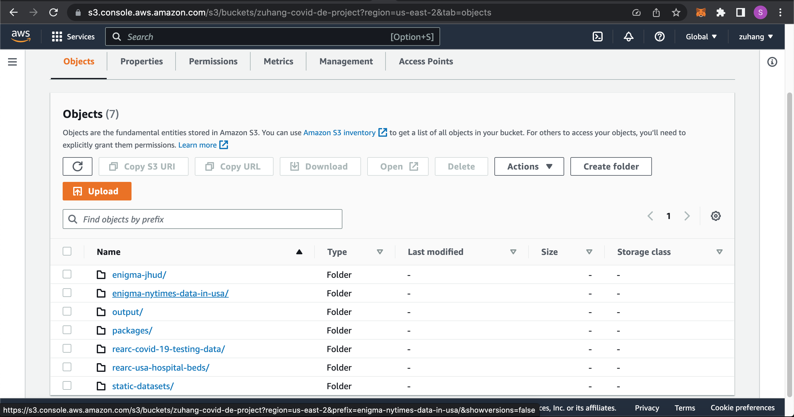
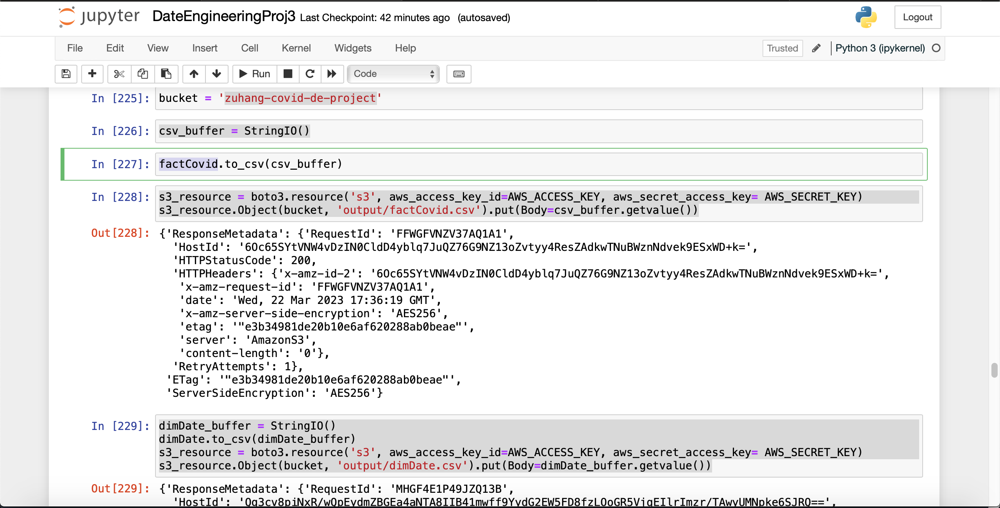

# Proj3-DataEngineering
## This project is a Cloud-based Big Data Engineering project
## Most of the work are done on AWS, including AWS Crawler, AWS Athena, AWS ETL Jobs, AWS Redshift, etc.

## Project Description:
* This data engineering project primarily focuses on processing and analyzing the datasets provided by AWS COVID-19 data lake.
* Applying an extremely import technique of Data Dimensional Modelling (DDM) to create Dimensions Model and Facts Model from raw models.
* Doing analysis and query through AWS Athena.
* Using data warehouse service provided by Amazon Web Services (AWS) Redshift, which is a fast, scalable, and cost-effective solution for analyzing large amounts of data. 
* By integrating AWS Redshift and other AWS services like S3, I can effectively do data processing and managing in and out of the Redshift.

## Project Steps:
* Create buckets on AWS S3 that stores the datasets to be worked with.

* Analyze the data through AWS Athena queries.
* Applyy the technique of Data Dimensional Modelling (DDM) and create Dimensions Model and Facts Model using Python.
* Three dimensions table: dimRegion, dimHospital, dimDate. One fact table: factCovid.
* Using python to store the models we just created to AWS S3.

