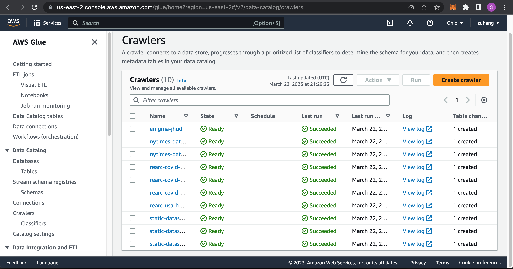
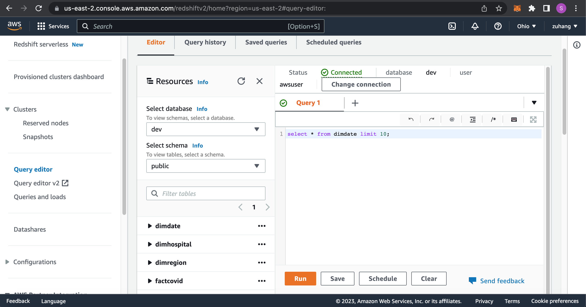
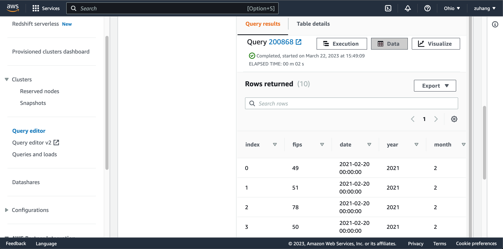
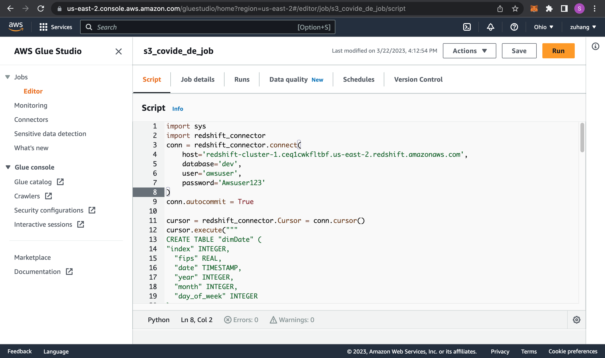
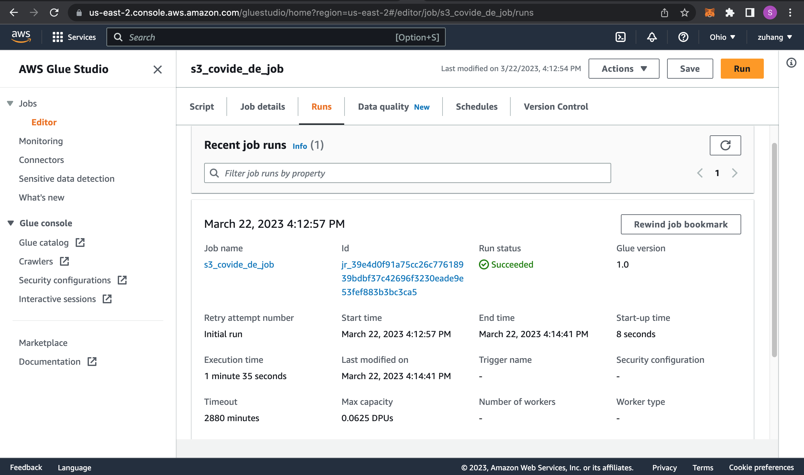
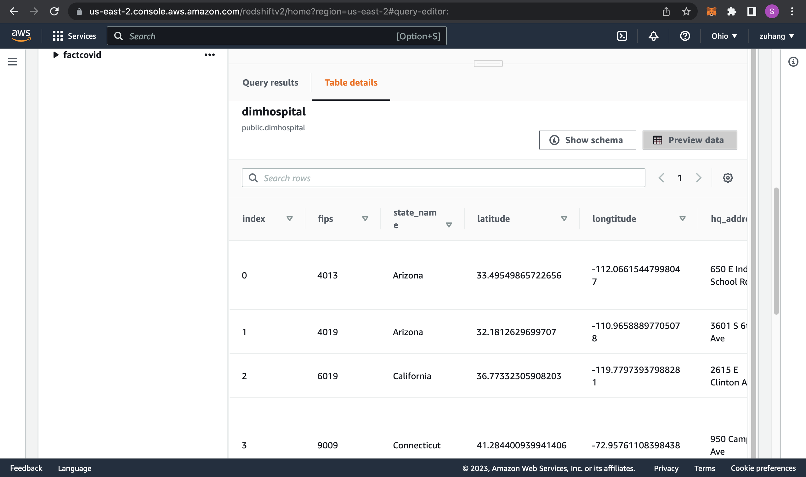
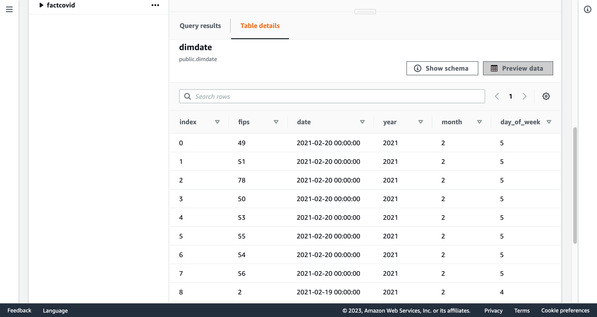
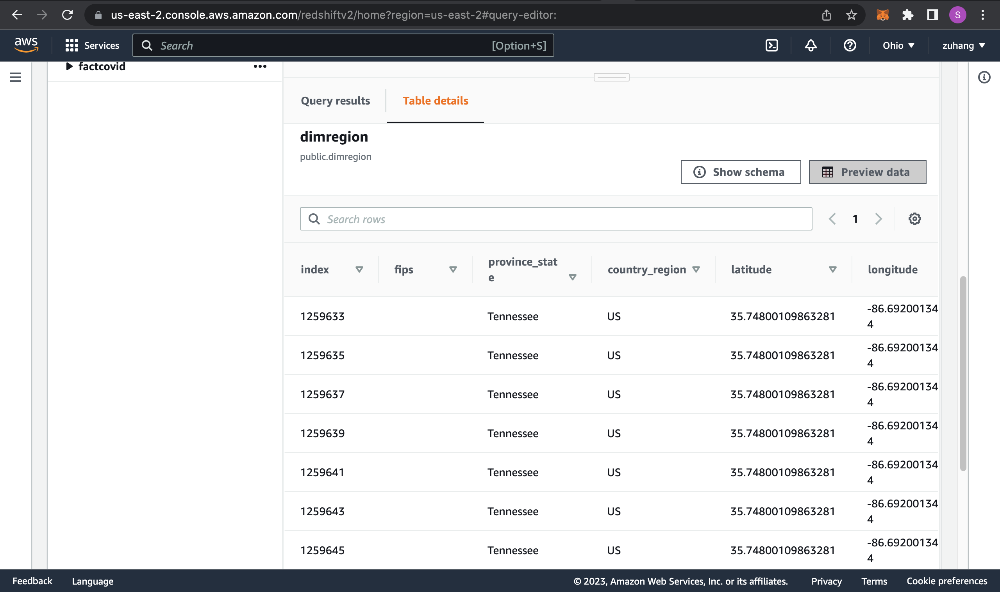
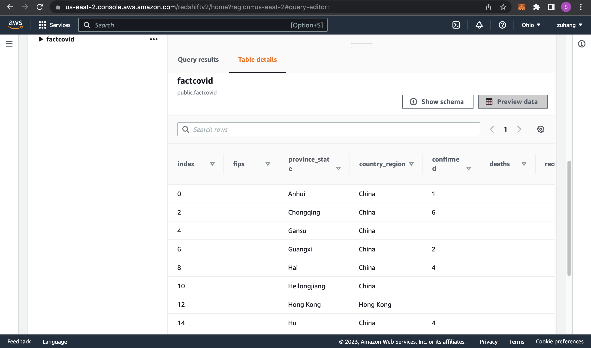

# Proj3-DataEngineering
## This project is a Cloud-based Big Data Engineering project
## Most of the work are done through AWS, including AWS Crawler, AWS Athena, AWS ETL Jobs, AWS Redshift, etc.

## Project Description:
* This data engineering project primarily focuses on processing and analyzing the datasets provided by AWS COVID-19 data lake.
* Applying an extremely import technique of Data Dimensional Modelling (DDM) to create Dimensions Model and Facts Model from raw models.
* Doing analysis and query through AWS Athena.
* Using data warehouse service provided by Amazon Web Services (AWS) Redshift, which is a fast, scalable, and cost-effective solution for analyzing large amounts of data. 
* By integrating AWS Redshift and other AWS services like S3, I can effectively do data processing and managing in and out of the Redshift.

## Project Steps:
* Create buckets on AWS S3 that stores the datasets to be worked with.

* Use AWS crawlers to determine the schema for the data, and creates corresponding metadata tables.

* Analyze the data through AWS Athena queries.
* Applyy the technique of Data Dimensional Modelling (DDM) and create Dimensions Model and Facts Model in Jupyter Nodebook using Python.
* Three dimensions table: dimRegion, dimHospital, dimDate. One fact table: factCovid.
* Using python to store the models we just created to AWS S3.

* Create a publicly accessible AWS Redshift Serverless instance and connecting to it
* Testing this Redshift cluster. Write Python in Jupyter Notebook to do the test using the following steps.
* Create Dimensions tables and Facts tables on Redshift

* Copy the data from S3 to the tables we just created on Redshift and make sure the data are successfully copied.

* The above image shows that everything works correctly. We can then start creating AWS Glue ETL Job.
* Create AWS Glue ETL Job(Python Shell script editor) that does the above steps of creating tables and copying data to AWS Redshift from AWS S3.

* Here showing that the job runs successfully.

* Make sure that all models are built successfully on Redshift Cluster.

* AWS Redshift can offer scalability and fast query performance that supports data engineering analyzing task.

## Reference:
https://github.com/darshilparmar/Data-Engineer-Tutorial-Series
